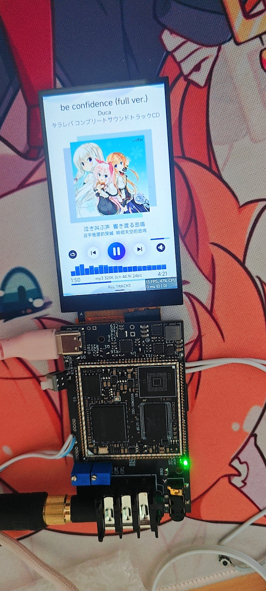

# ColorAudio

通用耳放，目前支持：
- 音乐播放
  - MP3音频解码，信息显示
  - FLAC音频解码，信息显示
- 蓝牙音频播放
  - SBC编码
  - AAC编码
  - aptx编码(freeaptx解码库)
- USB音频播放
  - UAC1 (最大96K 32bit，只能设置一种采样大小)
  - UAV2 (最大192K 32bit，支持多种采样大小)

主控RK3506，DAC：cs43198x2，运放：opa1622

linux6.1 RK的SDK

pcb目录是硬件原理图和PCB  
linux目录是RK SDK修补包  
src目录是软件程序源码

使用的其他开源代码库，直接使用代码编译  
| 名称  | 描述 | 链接 |
|---|---|---|
| Lvgl | 轻量界面框架 | [GitHub](https://github.com/lvgl/lvgl) |
| arduinoFFT | 快速傅里叶变换 | [GitHub](https://github.com/kosme/arduinoFFT) |
| nlohmann/json | json解析库 | [GitHub](https://github.com/nlohmann/json) |
| bluez-alsa | 蓝牙音频库 | [GitHub](https://github.com/arkq/bluez-alsa) |
| minimp4 | MP4文件解析 | [GitHub](https://github.com/lieff/minimp4) |
| ncmdump | ncm文件解析 | [GitHub](https://github.com/taurusxin/ncmdump) |

使用的开源库，使用链接方式  
| 名称  | 描述 | 链接 |
| libpng | png解码库 | [GitHub](https://github.com/pnggroup/libpng) |
| boost | C++库 | [boost](https://www.boost.org/) |
| flac | flac解码库 | [GitHub](https://github.com/xiph/flac) |
| libjpeg-turbo | jpeg解码库 | [GitHub](https://github.com/libjpeg-turbo/libjpeg-turbo) |
| libmad | MP3解码库 | [GitHub](https://github.com/markjeee/libmad) |
| openh264 | H264解码库 | [GitHub](https://github.com/cisco/openh264) |
| librime | 输入法 | [GitHub](https://github.com/rime/librime) |
